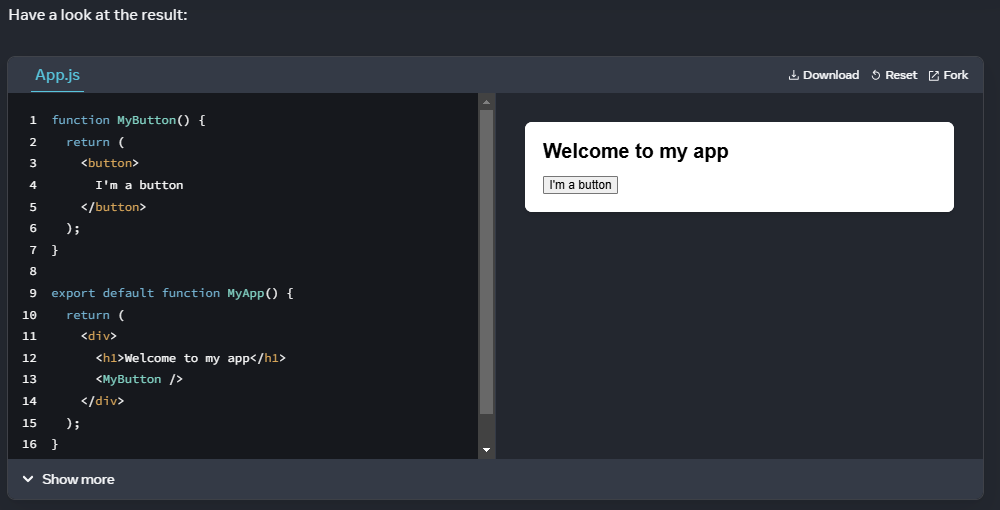
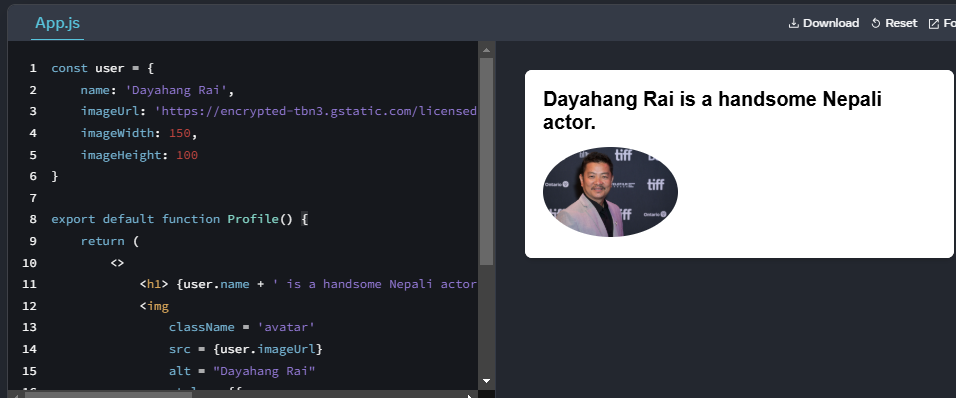

# React

## What is React & Why React

###### Rewriting from React Docs [React](https://react.dev/learn)

A Javascript Library for building user interfaces
React apps are made out of components. A component is a piece of the UI (user interface) that has its own logic and appearance. A component can be as small as a button, or as large as an entire page.

### React Components

React components are JavaScript functions that return markup:

```javascript
function MyButton() {
    return (
        <button> This is a button </button>
    )
}
```

Now that you’ve declared MyButton, you can nest it into another component:

```javascript
import MyButton from './components/MyButton.jsx'

export default function MyApp() {
    return (
        <div> 
            <h1> Welcome to my app </h1> 
            <MyButton>
        </div>
    )
}
```

Notice that <MyButton/> starts with a capital letter. That’s how you know it’s a React component. React component names must always start with a capital letter, while HTML tags must be lowercase.



The export default keywords specify the main component in the file. If you’re not familiar with some piece of JavaScript syntax, MDN and javascript.info have great references.

### Writing markup with JSX

The markup syntax you’ve seen above is called JSX. It is optional, but most React projects use JSX for its convenience. All of the tools we recommend for local development support JSX out of the box.

JSX is stricter than HTML. You have to close tags like ```<br/>```. Your component also can’t return multiple JSX tags. You have to wrap them into a shared parent, like a ```<div>...</div>``` or an empty ```<>...</>``` wrapper:

```javascript
function AboutPage() {
    return(
        <>
            <h1> About Us
            <p>We are developers</p>
        <>
    )
}
```

If you have a lot of HTML to port to JSX, you can use an [Online converter](https://transform.tools/html-to-jsx)

### Adding styles 

In React, you specify a CSS class with className. It works the same way as the HTML class attribute:

```javascript

```

Then you write the CSS rules for it in a separate CSS file:

```css
/* In your CSS */
.avatar {
  border-radius: 50%;
}
```

React does not prescribe how you add CSS files. In the simplest case, you’ll add a <link> tag to your HTML. If you use a build tool or a framework, consult its documentation to learn how to add a CSS file to your project.

### Displaying data 

JSX lets you put markup into JavaScript. Curly braces let you “escape back” into JavaScript so that you can embed some variable from your code and display it to the user. For example, this will display user.name:

```javascript
return (
    <h1>
        {user.name}
    </h1>
)
```

You can also “escape into JavaScript” from JSX attributes, but you have to use curly braces instead of quotes. For example, className="avatar" passes the "avatar" string as the CSS class, but src={user.imageUrl} reads the JavaScript user.imageUrl variable value, and then passes that value as the src attribute:

```javascript
return (
    
)
```

You can put more complex expressions inside the JSX curly braces too, for example, string concatenation:

```javascript
const user = {
    name: 'Dayahang Rai',
    imageUrl: 'https://encrypted-tbn3.gstatic.com/licensed-image?q=tbn:ANd9GcQ5wQF2_FwzOL1U1q0JHoAODAVRAt2q3sAL2zD6raOjyH-b0gtvQP_1lGYr0B1V7819v6LL_Vg7ERx3DOA',
    imageWidth: 150,
    imageHeight: 100
}

export default function Profile() {
    return (
        <>
            <h1> {user.name + ' is a handsome Nepali actor.'} </h1>
            
        </>
    )
}
```



In the above example, style={{}} is not a special syntax, but a regular {} object inside the style={ } JSX curly braces. You can use the style attribute when your styles depend on JavaScript variables.

### Conditional rendering 

In React, there is no special syntax for writing conditions. Instead, you’ll use the same techniques as you use when writing regular JavaScript code. For example, you can use an if statement to conditionally include JSX:

```javascript
let content;

if(isLoggedIn) {
    content = <UserPanel/>
}
else {
    content = <LoginPage/>
}

return (
    <div>
        {content}
    </div>
)

// If you prefer more compact code, you can use the conditional ? operator. Unlike if, it works inside JSX:

<div>
    {isLoggedIn ? (
        <UserPanel/>
    ) : (
        <LoginPage/>
    )}
</div>

// When you don’t need the else branch, you can also use a shorter logical && syntax:

<div>
  {isLoggedIn && <AdminPanel />}
</div>
```

All of these approaches also work for conditionally specifying attributes. If you’re unfamiliar with some of this JavaScript syntax, you can start by always using if...else.

### Rendering lists

You will rely on JavaScript features like for loop and the array map() function to render lists of components.

For example, let’s say you have an array of products:

```javascript
const products = [
  { title: 'Cabbage', id: 1 },
  { title: 'Garlic', id: 2 },
  { title: 'Apple', id: 3 },
]
```

// Inside your component, use the map() function to transform an array of products into an array of <li> items:

```javascript
const listItems = products.map(product =>
    <li key={product.id}>
        {product.title}
    </li>
)

return (
    <ul>{listItems}</ul>
)
```

Notice how list has a key attribute. For each item in a list, you should pass a string or a number that uniquely identifies that item among its siblings. Usually, a key should be coming from your data, such as a database ID. React uses your keys to know what happened if you later insert, delete, or reorder the items.

### Angela YU React course

React combines HTML, JavaScript and CSS.

Rendering data without reloading. Re-rendering the data using diffing technique by comparing the new DOM with old one.

Practice React on this website.
[Code Sandbox](https://codesandbox.io/)

### Introduction to JSX

JSX = JavaScript XML

Babel is a Javascript Compiler that powers JSX file by converting next generation javascript code to browser-compatible JavaScript code.

Challenge 1

```javascript
import React from "react";
import ReactDOM from "react-dom";

ReactDOM.render(
  <div>
    <h1>My heading</h1>
    <ul>
      <li>Item 1</li>
      <li>Item 2</li>
      <li>Item 3</li>
    </ul>
  </div>,
  document.getElementById("root")
);

```

### Adding JavaScript expression using 

Attributes of HTML element are camelcased in React with convention
Eg: class = 'container' becomes className = 'container' & so on.

Introduction to jsx

```javascript

import React from "react";
import ReactDOM from "react-dom";

ReactDOM.render(
  <div>
    <h1>Injecting HTML in Javascript</h1>
    <p>This is a paragraph</p>
  </div>,
  document.getElementById("root")
);

```

Adding dynamic date object in HTML

```javascript
// Create a react app from scratch
// It should display 2 paragraph HTML elements
// The paragraph should say:
// Created by Yourname
// Copyright CURRENTYEAR

import React from "react";
import ReactDOM from "react-dom";

const CURRENTYEAR = new Date().getFullYear();

ReactDOM.render(
  <div>
    <p> Created with ❤ by Pradip Timilsina </p>
    <p> Copyright @ {CURRENTYEAR}</p>
  </div>,
  document.getElementById("root")
);


```

Challenge

```javascript
//Create a react app from scratch.
//It should display a h1 heading.
//It should display an unordered list (bullet points).
//It should contain 3 list elements.

import React from "react";
import ReactDOM from "react-dom";

const img = "https://picsum.photos/200?random=1";

ReactDOM.render(
  <div>
    <h1 className="heading" contentEditable="true" spellCheck="false">
      My heading
    </h1>
    <div>
      
      
      
    </div>
  </div>,
  document.getElementById("root")
);


```
