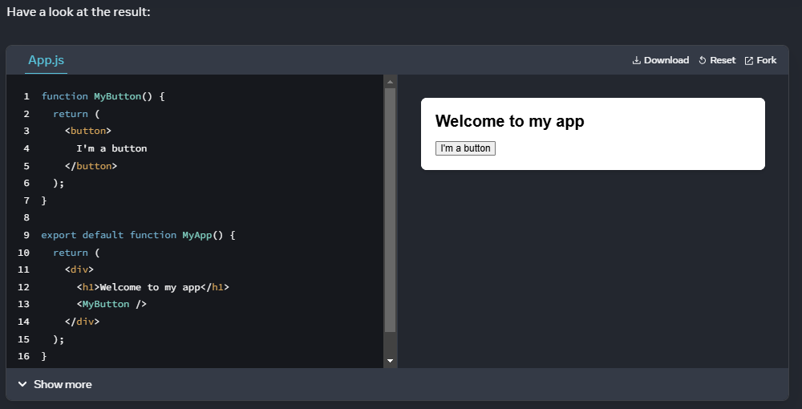
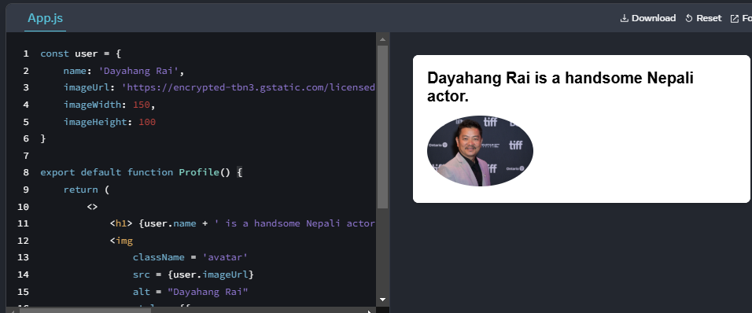

# Learn React in 2 months

## **Month 1: React Fundamentals & Core Concepts**

### **Week 1: Introduction & Setup**

✅ **Day 1:** What is React? Why use it? SPA vs. MPA  
✅ **Day 2:** Setting up a React project using Vite  
✅ **Day 3:** JSX and rendering elements  
✅ **Day 4:** Components (Functional & Class)  
✅ **Day 5:** Props and Component Reusability  
✅ **Day 6:** Hands-on: Create a simple Note Keeping App  
✅ **Day 7:** Revise & Practice (Add a feature to the Keeper App)

💡 **Challenge:** Build a **static portfolio website** with reusable components (Header, Footer, About, Projects).

---

### **Week 2: State & Events**

✅ **Day 8:** State Management using `useState`  
✅ **Day 9:** Handling Events & Event Binding  
✅ **Day 10:** Forms in React (Controlled vs Uncontrolled Components)  
✅ **Day 11:** Lists & Keys (Rendering multiple elements)  
✅ **Day 12:** Conditional Rendering (`if`, ternary, `&&`)  
✅ **Day 13:** Hands-on: Expand the Todo App (add editing functionality)  
✅ **Day 14:** Debugging React apps (React DevTools)

💡 **Challenge:** Create a **counter app** with increment, decrement, and reset buttons.

---

### **Week 3: Hooks & Lifecycle**

✅ **Day 15:** Introduction to Hooks (`useState`, `useEffect`)  
✅ **Day 16:** Effect Hook (`useEffect` with dependencies)  
✅ **Day 17:** Component Lifecycle (Mounting, Updating, Unmounting)  
✅ **Day 18:** Fetching data with `useEffect` (API calls)  
✅ **Day 19:** Custom Hooks (When & Why?)  
✅ **Day 20:** Hands-on: Build a simple weather app using an API  
✅ **Day 21:** Revise & Optimize

💡 **Challenge:** Create a **searchable user list** that fetches and filters user data from an API.

---

### **Week 4: React Router & Performance Optimization**

✅ **Day 22:** React Router (`BrowserRouter`, `Routes`, `Link`, `useParams`)  
✅ **Day 23:** Nested Routes, Protected Routes  
✅ **Day 24:** Code Splitting & Lazy Loading  
✅ **Day 25:** React.memo & `useCallback` for performance  
✅ **Day 26:** Error Boundaries & Suspense  
✅ **Day 27:** Hands

# React

## What is React & Why React

###### Rewriting from React Docs [React](https://react.dev/learn)

A JavaScript Library for building user interfaces
React apps are made out of components. A component is a piece of the UI (user interface) that has its own logic and appearance. A component can be as small as a button, or as large as an entire page.

### React Components

React components are JavaScript functions that return markup:

```javascript
function MyButton() {
  return <button> This is a button </button>;
}
```

Now that you’ve declared MyButton, you can nest it into another component:

```javascript
import MyButton from './components/MyButton.jsx'

export default function MyApp() {
    return (
        <>
            <h1> Welcome to my app </h1>
            <MyButton>
        </>
    )
}
```

Notice that <MyButton/> starts with a capital letter. That’s how you know it’s a React component. React component names must always start with a capital letter, while HTML tags must be lowercase.



The export default keywords specify the main component in the file. If you’re not familiar with some piece of JavaScript syntax, MDN and javascript.info have great references.

### Writing markup with JSX

The markup syntax you’ve seen above is called JSX. It is optional, but most React projects use JSX for its convenience. All of the tools we recommend for local development support JSX out of the box.

JSX is stricter than HTML. You have to close tags like `<br/>`. Your component also can’t return multiple JSX tags. You have to wrap them into a shared parent, like a `<div>...</div>` or an empty `<>...</>` wrapper:

```javascript
function AboutPage() {
    return(
        <>
            <h1> About Us
            <p>We are developers</p>
        <>
    )
}
```

If you have a lot of HTML to port to JSX, you can use an [Online converter](https://transform.tools/html-to-jsx)

### Adding styles

In React, you specify a CSS class with className. It works the same way as the HTML class attribute:

```javascript

```

Then you write the CSS rules for it in a separate CSS file:

```css
/* In your CSS */
.avatar {
  border-radius: 50%;
}
```

React does not prescribe how you add CSS files. In the simplest case, you’ll add a <link> tag to your HTML. If you use a build tool or a framework, consult its documentation to learn how to add a CSS file to your project.

### Displaying data

JSX lets you put markup into JavaScript. Curly braces let you “escape back” into JavaScript so that you can embed some variable from your code and display it to the user. For example, this will display user.name:

```javascript
return <h1>{user.name}</h1>;
```

You can also “escape into JavaScript” from JSX attributes, but you have to use curly braces instead of quotes. For example, className="avatar" passes the "avatar" string as the CSS class, but `src= {user.imageUrl}` reads the JavaScript ```user.imageUrl``` variable value, and then passes that value as the `src` attribute:

```javascript
return ;
```

You can put more complex expressions inside the JSX curly braces too, for example, string concatenation:

```javascript
const user = {
  name: "Dayahang Rai",
  imageUrl:
    "https://encrypted-tbn3.gstatic.com/licensed-image?q=tbn:ANd9GcQ5wQF2_FwzOL1U1q0JHoAODAVRAt2q3sAL2zD6raOjyH-b0gtvQP_1lGYr0B1V7819v6LL_Vg7ERx3DOA",
  imageWidth: 150,
  imageHeight: 100,
};

export default function Profile() {
  return (
    <>
      <h1> {user.name + " is a handsome Nepali actor."} </h1>
      
    </>
  );
}
```



In the above example, style={{}} is not a special syntax, but a regular {} object inside the style={ } JSX curly braces. You can use the style attribute when your styles depend on JavaScript variables.

### Conditional rendering

In React, there is no special syntax for writing conditions. Instead, you’ll use the same techniques as you use when writing regular JavaScript code. For example, you can use an if statement to conditionally include JSX:

```javascript
let content;

if(isLoggedIn) {
    content = <UserPanel/>
}
else {
    content = <LoginPage/>
}

return (
    <div>
        {content}
    </div>
)

// If you prefer more compact code, you can use the conditional ? operator. Unlike if, it works inside JSX:

<div>
    {isLoggedIn ? (
        <UserPanel/>
    ) : (
        <LoginPage/>
    )}
</div>

// When you don’t need the else branch, you can also use a shorter logical && syntax:

<div>
  {isLoggedIn && <AdminPanel />}
</div>
```

All of these approaches also work for conditionally specifying attributes. If you’re unfamiliar with some of this JavaScript syntax, you can start by always using if...else.

### Rendering lists

You will rely on JavaScript features like for loop and the array map() function to render lists of components.

For example, let’s say you have an array of products:

```javascript
const products = [
  { title: "Cabbage", id: 1 },
  { title: "Garlic", id: 2 },
  { title: "Apple", id: 3 },
];
```

// Inside your component, use the map() function to transform an array of products into an array of <li> items:

```javascript
const listItems = products.map((product) => (
  <li key={product.id}>{product.title}</li>
));

return <ul>{listItems}</ul>;
```

Notice how list has a key attribute. For each item in a list, you should pass a string or a number that uniquely identifies that item among its siblings. Usually, a key should be coming from your data, such as a database ID. React uses your keys to know what happened if you later insert, delete, or reorder the items.

### Angela YU React course

React combines HTML, JavaScript and CSS.

Rendering data without reloading. Re-rendering the data using diffing technique by comparing the new DOM with old one.

Practice React on this website.
[Code Sandbox](https://codesandbox.io/)

### Introduction to JSX

JSX = JavaScript XML

Babel is a JavaScript Compiler that powers JSX file by converting next generation JavaScript code to browser-compatible JavaScript code.

Challenge 1

```javascript
import React from "react";
import ReactDOM from "react-dom";

ReactDOM.render(
  <div>
    <h1>My heading</h1>
    <ul>
      <li>Item 1</li>
      <li>Item 2</li>
      <li>Item 3</li>
    </ul>
  </div>,
  document.getElementById("root")
);
```

### Adding JavaScript expression using

Attributes of HTML element are camelCase in React with convention
Example: class = 'container' becomes className = 'container' & so on.

Introduction to JSX

```javascript
import React from "react";
import ReactDOM from "react-dom";

ReactDOM.render(
  <div>
    <h1>Injecting HTML in Javascript</h1>
    <p>This is a paragraph</p>
  </div>,
  document.getElementById("root")
);
```

Adding dynamic date object in HTML

```javascript
// Create a react app from scratch
// It should display 2 paragraph HTML elements
// The paragraph should say:
// Created by Yourname
// Copyright CURRENTYEAR

import React from "react";
import ReactDOM from "react-dom";

const CURRENTYEAR = new Date().getFullYear();

ReactDOM.render(
  <div>
    <p> Created with ❤ by Pradip Timilsina </p>
    <p> Copyright @ {CURRENTYEAR}</p>
  </div>,
  document.getElementById("root")
);
```

Challenge

```javascript
//Create a react app from scratch.
//It should display a h1 heading.
//It should display an unordered list (bullet points).
//It should contain 3 list elements.

import React from "react";
import ReactDOM from "react-dom";

const img = "https://picsum.photos/200?random=1";

ReactDOM.render(
  <div>
    <h1 className="heading" contentEditable="true" spellCheck="false">
      My heading
    </h1>
    <div>
      
      
      
    </div>
  </div>,
  document.getElementById("root")
);
```

Class based styling is recommended over inline styling.

#### Inline styling

```javascript
import React from "react";
import ReactDOM from "react-dom";

const customStyle = {
  color: "red",
  fontSize: "24px",
  border: "2px solid blue",
};

customStyle.color = "green";

ReactDOM.render(
  <div>
    <h1 style={customStyle}>Hello World!</h1>
    <h2 style={{ color: "red" }}> Red Heading </h2>
  </div>,
  document.getElementById("root")
);
```

Displaying greeting based on hours

index.html

```html
<!DOCTYPE html>
<html lang="en">
  <head>
    <title>JSX</title>
    <link rel="stylesheet" href="styles.css" />
  </head>

  <body>
    <div id="root"></div>
    <script src="../src/index.js" type="text/JSX"></script>
  </body>
</html>
```

styles.css

```css
.heading {
  font-size: 50px;
  font-weight: bold;
  border-bottom: 5px solid black;
}
```

```javascript
//Create a React app from scratch.
//Show a single h1 that says "Good morning" if between midnight and 12PM.
//or "Good Afternoon" if between 12PM and 6PM.
//or "Good evening" if between 6PM and midnight.
//Apply the "heading" style in the styles.css
//Dynamically change the color of the h1 using inline css styles.
//Morning = red, Afternoon = green, Night = blue.

import React from "react";
import ReactDOM from "react-dom";

const date = new Date(2022, 1, 1, 1, 1);
let hour = date.getHours();

let greeting = "";
const customStyle = {};

if (hour >= 0 && hour < 12) {
  greeting = "morning";
  customStyle.color = "red";
} else if (hour >= 12 && hour < 18) {
  greeting = "afternoon";
  customStyle.color = "green";
} else {
  greeting = "evening";
  customStyle.color = "blue";
}

ReactDOM.render(
  <h1 className="heading" style={customStyle}>
    Good {greeting}{" "}
  </h1>,
  document.getElementById("root")
);
```

#### React Component

index.html

```html
<!DOCTYPE html>
<html lang="en">
  <head>
    <title>JSX</title>
    <link rel="stylesheet" href="styles.css" />
  </head>

  <body>
    <div id="root"></div>
    <script src="../src/index.js" type="text/JSX"></script>
  </body>
</html>
```

index.js

```javascript
import React from "react";
import ReactDOM from "react-dom";

import App from "./components/App";

ReactDOM.render(<App />, document.getElementById("root"));
```

```jsx
// App.jx

import React from "react";
import ReactDOM from "react-dom";

import Heading from "./HeadingComponent";
import List from "./ListComponent";

export default function App() {
  return (
    <div>
      <Heading />
      <List />
    </div>
  );
}
```

```jsx
// HeadingComponent.jsx

import React from "react";

function Heading() {
  return <h1>My Favourite Foods</h1>;
}

export default Heading;
```

```jsx
// ListComponent.jsx

import React from "react";

export default function List() {
  return (
    <ul>
      <li>Bacon</li>
      <li>Jamon</li>
      <li>Noodles</li>
    </ul>
  );
}
```

File Path

```plaintext
/components/App.jsx
/components/heading.jsx
/components/ListComponent.jsx
```

### React Props


# React Props (Properties)

## What are Props?

Props are **read-only attributes** in React that allow you to pass data from a **parent component** to a **child component**. They make components reusable and dynamic by enabling customization.

---

## Key Features:

1. **Immutable**: Props cannot be modified by the child component.
2. **Passed as Attributes**: Props are passed as attributes in JSX.
3. **Accessed via `props`**: In functional components, props are accessed as function arguments.

---

## Example from Your Folder:

### Parent Component (`index.js`):

```javascript

import React from "react";
import ReactDOM from "react-dom";

function Card(props) {
  return (
    <>
      <h2>{props.name}</h2>
      
      <p>{props.tel}</p>
      <p>{props.email}</p>
    </>
  );
}

ReactDOM.render(
  <div>
    <h1>My Contacts</h1>
    <Card
      name="Beyonce"
      img="https://blackhistorywall.files.wordpress.com/2010/02/picture-device-independent-bitmap-119.jpg"
      tel="+123 456 789"
      email="b@beyonce.com"
    />
    <Card
      name="Jack Bauer"
      img="https://pbs.twimg.com/profile_images/625247595825246208/X3XLea04_400x400.jpg"
      tel="+7387384587"
      email="jack@nowhere.com"
    />
  </div>,
  document.getElementById("root")
);
```

### Explanation:

1. **Parent Component**:

   - The `Card` component is used multiple times with different props (`name`, `img`, `tel`, `email`).
   - Props are passed as attributes in JSX.

2. **Child Component (`Card`)**:
   - The `Card` component receives props as a parameter.
   - Props are used to dynamically render the content.


## Why Use Props?

- **Reusability**: Create one component and reuse it with different data.
- **Dynamic Rendering**: Pass dynamic data to components.


## Best Practices:

1. Always use **unique keys** when rendering lists of components.
2. Use **PropTypes** for type-checking props (optional).


## References:

- [React Props Documentation](https://reactjs.org/docs/components-and-props.html)
- [My Practice Example](./3.React%20Props/src/index.js)

---

# Usage of `map()` Function in React

The `map()` function is a powerful JavaScript array method that is widely used in React to render lists of components dynamically. It allows you to iterate over an array and transform each element into a React component.

---

## Key Features of `map()` in React:
1. **Dynamic Rendering**: Render lists of components based on data.
2. **Reusability**: Use the same component for multiple data entries.
3. **Key Prop**: Each rendered component must have a unique `key` prop for efficient updates.

---

## Example from Your Folder:

### File Structure:
- `App.jsx`
- `Card.jsx`
- `contacts.js`

### Data File (`contacts.js`):
```javascript
const contacts = [
  {
    id: 1,
    name: "Beyonce",
    img: "https://blackhistorywall.files.wordpress.com/2010/02/picture-device-independent-bitmap-119.jpg",
    tel: "+123 456 789",
    email: "b@beyonce.com",
  },
  {
    id: 2,
    name: "Jack Bauer",
    img: "https://pbs.twimg.com/profile_images/625247595825246208/X3XLea04_400x400.jpg",
    tel: "+7387384587",
    email: "jack@nowhere.com",
  },
  {
    id: 3,
    name: "Chuck Norris",
    img: "https://i.pinimg.com/originals/2e/24/0f/2e240f7a2c3c6c9b3f6a4f2a4e9b5c6c.jpg",
    tel: "+987 654 321",
    email: "chuck@norris.com",
  },
];

export default contacts;


/// Parent Component (`App.jsx`):

import React from "react";
import Card from "./components/Card";
import contacts from "./assets/contacts";

function App() {
  return (
    <div>
      <h1 className="heading">My Contacts</h1>
      {contacts.map((contact) => (
        <Card
          key={contact.id}
          name={contact.name}
          img={contact.img}
          tel={contact.tel}
          email={contact.email}
        />
      ))}
    </div>
  );
}

export default App;


// Child Component (`Card.jsx`):

import React from "react";

function Card(props) {
  return (
    <div className="card">
      <h2>{props.name}</h2>
      
      <p>{props.tel}</p>
      <p>{props.email}</p>
    </div>
  );
}

export default Card;
```

---

## Explanation:

1. **Data Source**:
   - The `contacts.js` file contains an array of objects, each representing a contact with properties like `name`, `img`, `tel`, and `email`.

2. **Parent Component (`App.jsx`)**:
   - The `map()` function is used to iterate over the `contacts` array.
   - For each contact, a `Card` component is rendered with props (`name`, `img`, `tel`, `email`) passed dynamically.
   - The `key` prop is added to uniquely identify each `Card` component.

3. **Child Component (`Card.jsx`)**:
   - The `Card` component receives props and renders the contact details dynamically.

---

## Why Use `map()` in React?

- **Efficiency**: React uses the `key` prop to optimize rendering by identifying which components need to be updated.
- **Dynamic Content**: Easily render lists of components based on data.
- **Reusability**: Use the same component for different data entries.

---

## Best Practices:
1. Always provide a **unique `key` prop** for each element rendered using `map()`.
2. Keep the `map()` logic in the parent component for better separation of concerns.
3. Avoid inline functions inside `map()` for performance optimization.

---

## References:
- [React Documentation: Lists and Keys](https://reactjs.org/docs/lists-and-keys.html)
- [MDN Documentation: Array.prototype.map()](https://developer.mozilla.org/en-US/docs/Web/JavaScript/Reference/Global_Objects/Array/map)

---

## Production Build Vite Project

What happens when you run ```npm run build```

```"build": "vite build"```

When you run `vite build` in your Vite project, the following happens:

### 1. **Production Build Process**
   - Vite bundles your application into optimized static files for production.
   - It performs the following optimizations:
     - **Minification**: JavaScript, CSS, and HTML files are minified to reduce file size.
     - **Tree Shaking**: Removes unused code to make the bundle smaller.
     - **Code Splitting**: Splits the code into smaller chunks for better performance.
     - **Asset Optimization**: Optimizes images, fonts, and other assets.
     - **Environment Variables**: Uses `process.env.NODE_ENV=production` to enable production-specific behavior.

### 2. **Output Files**
   - The build output is placed in the `dist/` folder (default location).
   - The `dist/` folder contains:
     - **`index.html`**: The entry point for your app.
     - **JavaScript files**: Bundled and minified JavaScript files (e.g., `assets/index-<hash>.js`).
     - **CSS files**: Extracted and minified CSS files (e.g., `assets/index-<hash>.css`).
     - **Static assets**: Any images, fonts, or other files referenced in your app.

### 3. **Deployment-Ready**
   - The files in the `dist/` folder are static and can be deployed to any web server (e.g., Apache, Nginx, Vercel, Netlify).
   - These files no longer rely on the development server or WebSocket connections.

### Example of the `dist/` folder structure:
```
dist/
├── index.html
├── assets/
│   ├── index-abc123.js
│   ├── index-abc123.css
│   ├── logo-xyz456.png
```

### Summary:
Running `vite build` prepares your project for production by creating an optimized, static version of your app in the `dist/` folder. These files are ready to be deployed to a live server.
